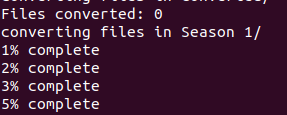
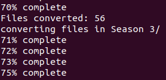
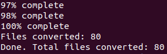

# Video Converter
Small bash script for converting a bunch of video files from one format to another using ffmpeg.

## Run
0. Make sure you have [ffmpeg](https://ffmpeg.org/) installed.
1. Put the script in the directory containing your video files.
2. Make it executable `chmod +x converter.sh`
3. Run it with the source file format as first argument and target file format as second argument e.g: `./converter.sh avi mp4` 







## Note
Currently it only recurses one level of directories i.e.

```
/MyDirectory
           |
           converter.sh //Put the script here
           |
           videofile //All these will be converted
           videofile
           ...
           /Folder1 
               videofile //All these will be converted
               videofile
               ...
           /Folder2 
               videofile //All these will be converted
               videofile
               ...
           /Converted
               //converted files will be put here
```

# Todo
- [ ] Add argument for specifying directory to run in
- [ ] Error message if non-supported video formats entered
- [ ] Percentage complete should be on same line
- [ ] Add multiple recursion
- [ ] Add fast/slow argument for selecting between copying (fast) or re-encoding (slow) options in ffmpeg
